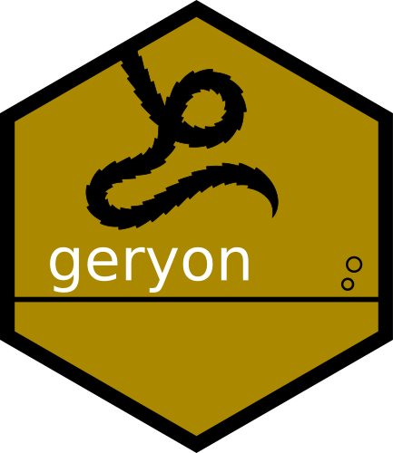
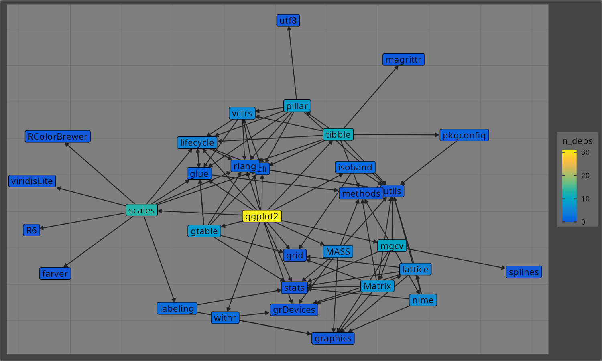
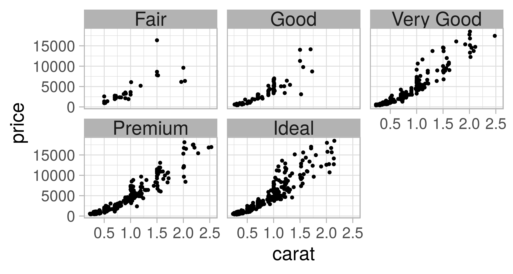
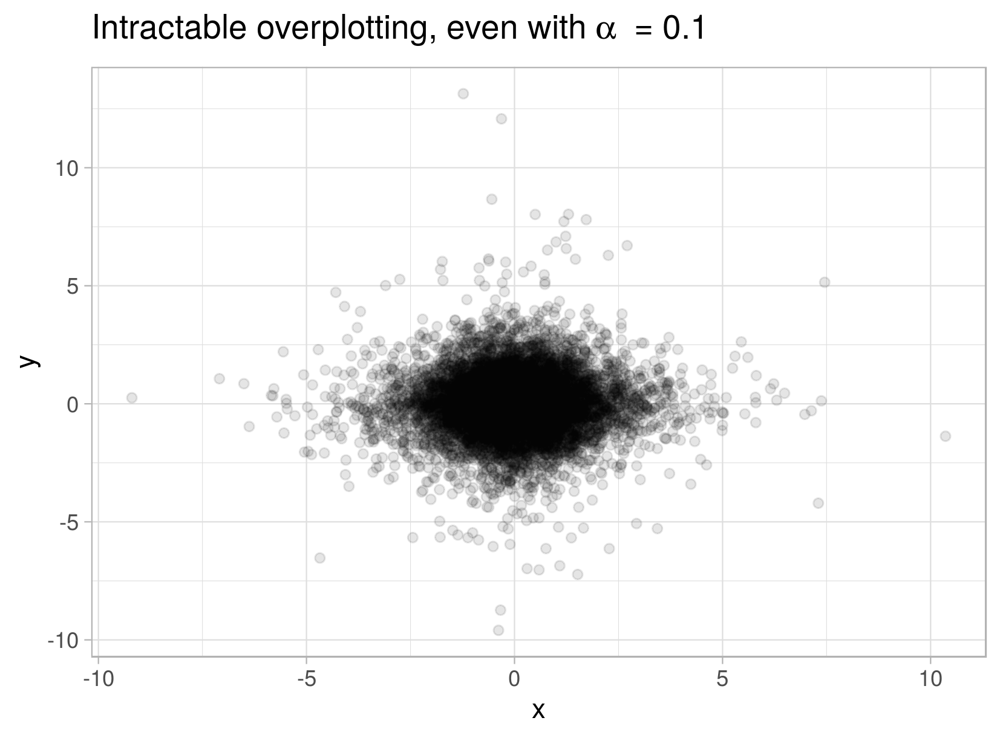
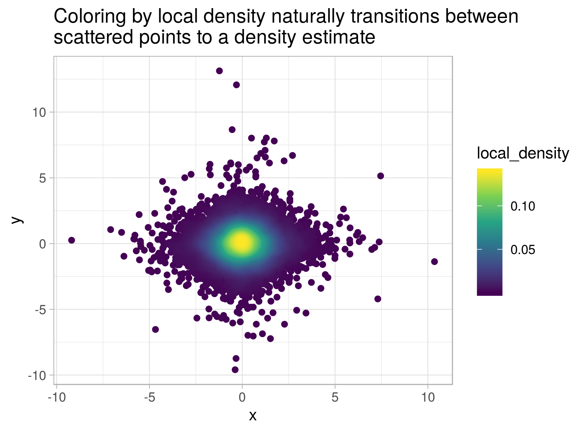

<!-- README.md is generated from README.Rmd. Please edit that file -->

```{r, include = FALSE}
knitr::opts_chunk$set(
  collapse = TRUE,
  comment = "#>",
  fig.path = "man/figures/README-",
  out.width = "100%"
)
```

# geryon 

<!-- badges: start -->
<!-- [](https://www.tidyverse.org/lifecycle/#experimental)
<!-- [](https://CRAN.R-project.org/package=geryon)
<!-- badges: end -->

This package contains a variety of small functions.

## Installation

You can install the released version of geryon from this Github repo.

```{r eval=FALSE}
remotes::install_github("andrewGhazi/geryon")
```

## Functionality

### `timer`

`geryon::timer(1/20)` to set a timer for three seconds. 

### Package dependency inspection

Functions for package developers trying to prioritize dependencies for removal. Powered by `pak::pkg_deps()`. `plot_deps_graph()` and `uniq_pkg_deps()`. For example you can see that for the `ggplot2` devs, removing `scales` would lighten their dependency footprint the most:

```{r}
library(geryon)

uniq_pkg_deps("ggplot2", order = 1) |> suppressMessages()
```

```{r eval=FALSE}
plot_deps_graph("ggplot2")
```


```{r echo = FALSE, out.width = '75%'}

```

### `ws_size`

It's easy to see the memory usage of a single object with `object.size` but doing that in a sorted, pretty way for everything in the workspace is a bit more involved. This function has taken care of that. 

```
> a = 1:10
> tmp = mtcars
> ws_size()
      obj   obj_size
   <char> <fs_bytes>
1:    tmp      7.04K
2:      a        680
```

### `pull1`

`dplyr::pull` is a convenient way to pull out the values of a column from a data frame, but if you've got a long list column and just want to check one to make sure everything's working, printing the whole list can clutter up the console. `pull1` just pulls out one (the first, by default). 

```{r message=FALSE}
library(data.table)
options(digits = 2)

tmp = data.table(samples = replicate(3, rnorm(3), simplify = FALSE)) 
tmp
tmp |> pull1(samples)
```

### `theme_pres`

This is simply a modified version of `ggplot2::theme_light` with larger text and dark facet labels. This makes it easier to prepare easy-to-read plots for presentations.

```{r eval = FALSE}
library(ggplot2)

diamonds[sample.int(nrow(diamonds), 1e3),] |>
  ggplot(aes(carat, price)) +
  geom_point() +
  theme_pres() +
  facet_wrap("cut")
```

```{r echo = FALSE, out.width = '75%'}

```

### `corner`

Print the top left (by default) corner of large rectangular objects:

```{r}
X = matrix(rnorm(1e4), nrow = 100, ncol = 100)

corner(X)
```

### `fpat`

Filter rows matching a pattern in a column:

```{r}
ggplot2::diamonds |> fpat("Good", cut)
```

### `find_dups` / `has_dups`

Filter a data frame to rows where the given column has duplicates (i.e. don't drop the first occurrence):

```{r}
mtcars |> find_dups(wt)
```


### get/add_local_density

This is handy for dealing with severe overplotting in situations where you still want to plot individual points rather than a density estimate. You simply give `add_local_density` the two variables used in your plot, then you aesthetically map the resulting `local_density` column to color.

```{r out.width = '75%', eval = FALSE}
overplotted = data.frame(x = c(rnorm(1e4, sd = 3), 
                               rnorm(3e2, c(-1,1), sd = .1), 
                               seq(-1,1, length.out = 300)),
                         y = c(rnorm(1e4, sd = 3), 
                               rnorm(3e2, 2, sd = .1), 
                               seq(-1,1, length.out = 300)^2 - 1))

overplotted |> 
  ggplot(aes(x,y)) +
  geom_point(alpha = .1) + 
  theme_light() + 
  labs(title = expression('Intractable overplotting, even with'~alpha~' = 0.1'))
```
```{r echo = FALSE, out.width = '75%'}

```

```{r eval = FALSE}
library(geryon)

overplotted |> 
  add_local_density(x, y, bw = .02) |> 
  ggplot(aes(x,y)) +
  geom_point(aes(color = local_density)) + 
  theme_light() + 
  scale_color_viridis_c()  
```
```{r echo = FALSE, out.width='75%'}

```

This is a trivial example but sometimes there's simultaneously important structure hidden in the overplotted region AND important meaning associated with individual points in the sparse outer regions. This sort of plot shows both.

I'm working on a color_density_scatter function that goes straight from the data to the plot.

### `insert_img_link()`

This function inserts an image link (``) to an image on your clipboard into the current source document at the cursor. This way you don't have to fuss around with the file manager to [get images into your Quarto report](https://quarto.org/docs/authoring/figures.html).

It's provided as an RStudio addin so you can bind a keyboard shortcut to it. I use `Ctrl+Shift+H`.

This function makes some assumptions and currently doesn't do many checks. There are some caveats: 

* It only inserts PNGs. I'll probably add jpg sooner or later.
  * It won't work if you currently have multiple images on your clipboard.
* It uses [xclip](https://www.mankier.com/1/xclip#) to copy from the image from the clipboard to the `images/` directory. That must be installed.
* There must be an `images/` directory in the same directory as the source document.
* It doesn't clean up after itself. If you use it a lot, you might end up with many copies of the same image in your images directory.
