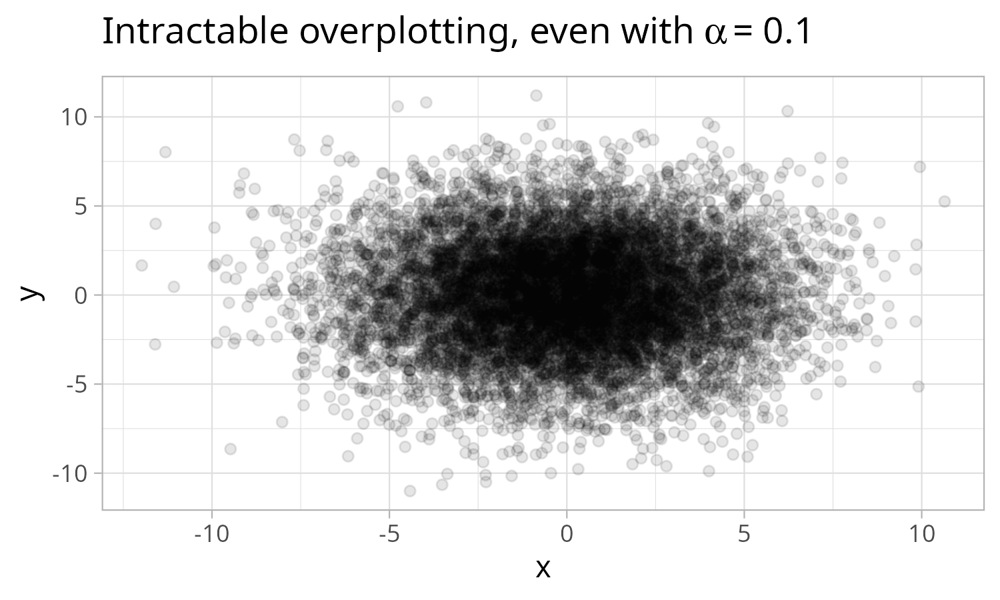

<!-- README.md is generated from README.Rmd. Please edit that file -->

# geryon 

<!-- badges: start -->
<!-- [](https://www.tidyverse.org/lifecycle/#experimental)
<!-- [](https://CRAN.R-project.org/package=geryon)
<!-- badges: end -->

This is a package containing small utility functions.

## Installation

You can install the released version of geryon from this Github repo.

``` r
remotes::install_github("andrewGhazi/geryon")
```

## Functionality

Right now this package contains only a handful of functions: `ws_size`,
`pull1`, `get/add_local_density` and `theme_pres`.

### ws\_size

It’s easy to see the memory usage of a single object with `object.size`
but doing that in a sorted, pretty way for everything in the workspace
is a bit more involved. This function has taken care of that.

    > a = 1:10
    > tmp = mtcars
    > ws_size()
    # A tibble: 2 x 3
        obj obj_size n_bytes
      <chr>    <chr>   <int>
    1   tmp   6.6 Kb    6736
    2     a 88 bytes      88

### pull1

`dplyr::pull` is a convenient way to pull out the values of a column
from a data frame, but if you’ve got a long list column and just want to
check one to make sure everything’s working, printing the whole list can
clutter up the console. `pull1` just pulls out one.

    > tmp = data_frame(mu = 5:10, samples = purrr::map(mu, ~rnorm(10, mean = .x, sd = 1)))
    > tmp
    # A tibble: 6 x 2
         mu    samples
      <int>     <list>
    1     5 <dbl [10]>
    2     6 <dbl [10]>
    3     7 <dbl [10]>
    4     8 <dbl [10]>
    5     9 <dbl [10]>
    6    10 <dbl [10]>
    > tmp %>% pull1(samples)
     [1] 4.651063 3.986187 5.421502 4.554197 4.880644 4.511554 5.572671 4.948658 6.132115 5.545000

### theme\_pres

This is simply a modified version of `ggplot2::theme_light` with larger
text and dark facet labels. This makes it easier to prepare easy-to-read
plots for presentations.

    diamonds %>% sample_n(1000) %>% ggplot(aes(carat, price)) + geom_point() + theme_pres() + facet_wrap('cut')


### get/add\_local\_density

This is handy for dealing with severe overplotting in situations where
you still want to plot individual points rather than a density estimate.
You simply give `add_local_density` the two variables used in your plot,
then you aesthetically map the resulting `local_density` column to
color.

``` r
library(ggplot2)
library(magrittr)
overplotted = data.frame(x = rt(1e4, df = 5),
                         y = rt(1e4, df = 5))
overplotted %>% 
  ggplot(aes(x,y)) +
  geom_point(alpha = .1) + 
  theme_light() + 
  labs(title = expression('Intractable overplotting, even with'~alpha~' = 0.1'))
```



``` r
library(geryon)
overplotted %>% 
  add_local_density(x, y) %>% 
  ggplot(aes(x,y)) +
  geom_point(aes(color = local_density)) + # <-- this is the important bit
  theme_light() + 
  scale_color_viridis_c() + 
  labs(title = 'Coloring by local density naturally transitions between\nscattered points to a density estimate')
```


This is a trivial example but sometimes there’s simultaneously important
structure hidden in the overplotted region AND important meaning
associated with individual points in the sparse outer regions. This sort
of plot shows both.

I’m working on a color\_density\_scatter function that goes straight
from the data to the plot.
