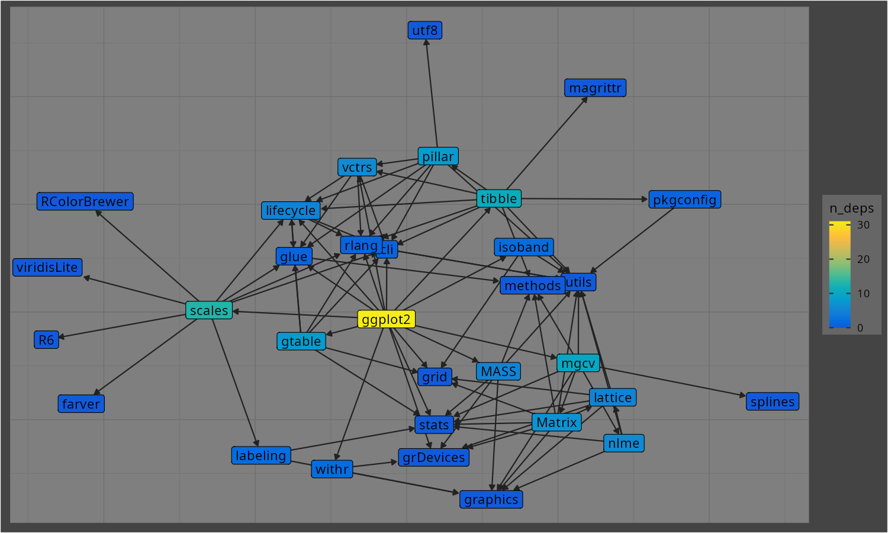
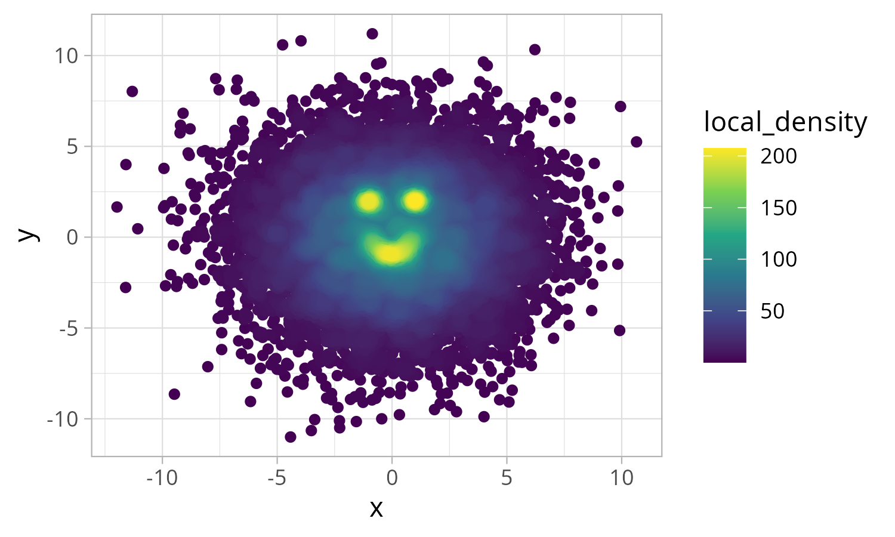

<!-- README.md is generated from README.Rmd. Please edit that file -->

# geryon 

<!-- badges: start -->

<!-- [](https://www.tidyverse.org/lifecycle/#experimental)
<!-- [](https://CRAN.R-project.org/package=geryon)
<!-- badges: end -->

This package contains a variety of small functions.

## Installation

You can install `geryon` from this repo with this command:

``` r
remotes::install_github("andrewGhazi/geryon")
```

## Functionality

### `timer`

`geryon::timer(1/20)` to set a timer for three seconds.

### Package dependency inspection

Functions for package developers trying to prioritize dependencies for
removal. Powered by `pak::pkg_deps()`. `plot_deps_graph()` and
`uniq_pkg_deps()`. For example you can see that for the `ggplot2` devs,
removing `scales` would lighten their dependency footprint the most:

``` r
library(geryon)

uniq_pkg_deps("ggplot2", order = 1) |> suppressMessages()
#>         pkg1 n_uniq_deps                                       uniq_deps
#> 1     scales           6 farver, labeling, R6, RColorBrewer, viridisLite
#> 2       mgcv           5                  Matrix, nlme, splines, lattice
#> 3     tibble           5               utf8, magrittr, pillar, pkgconfig
#> 4        cli           1                                                
#> 5       glue           1                                                
#> 6  grDevices           1                                                
#> 7       grid           1                                                
#> 8     gtable           1                                                
#> 9    isoband           1                                                
#> 10 lifecycle           1                                                
#> 11      MASS           1                                                
#> 12     rlang           1                                                
#> 13     stats           1                                                
#> 14     vctrs           1                                                
#> 15     withr           1
```

``` r
plot_deps_graph("ggplot2")
```



### `ws_size`

It’s easy to see the memory usage of a single object with `object.size`
but doing that in a sorted, pretty way for everything in the workspace
is a bit more involved. This function has taken care of that.

    > a = 1:10
    > tmp = mtcars
    > ws_size()
          obj   obj_size
       <char> <fs_bytes>
    1:    tmp      7.04K
    2:      a        680

### `pull1`

`dplyr::pull` is a convenient way to pull out the values of a column
from a data frame, but if you’ve got a long list column and just want to
check one to make sure everything’s working, printing the whole list can
clutter up the console. `pull1` just pulls out one (the first, by
default).

``` r
library(data.table)
options(digits = 2)

tmp = data.table(samples = replicate(3, rnorm(3), simplify = FALSE)) 
tmp
#>                    samples
#>                     <list>
#> 1:        1.63,-0.50, 0.55
#> 2:  1.1873, 0.0079,-1.8897
#> 3:    -0.032,-0.157,-0.260
tmp |> pull1(samples)
#> [1]  1.63 -0.50  0.55
```

### `theme_pres`

This is simply a modified version of `ggplot2::theme_light` with larger
text and dark facet labels. This makes it easier to prepare easy-to-read
plots for presentations.

``` r
library(ggplot2)

diamonds[sample.int(nrow(diamonds), 1e3),] |>
  ggplot(aes(carat, price)) +
  geom_point() +
  theme_pres() +
  facet_wrap("cut")
```


### `corner`

Print the top left (by default) corner of large rectangular objects:

``` r
X = matrix(rnorm(1e4), nrow = 100, ncol = 100)

corner(X)
#>       [,1]  [,2]  [,3]   [,4]   [,5]
#> [1,] -1.71 -0.40 -1.03 -0.487 -0.258
#> [2,]  0.79  0.38 -0.95 -0.308 -0.357
#> [3,]  0.23  0.49 -0.90  2.517  0.085
#> [4,] -1.45  0.98 -0.93 -0.092  0.148
#> [5,] -0.65  0.21  0.37 -0.372 -0.823
```

### `fpat`

Filter rows matching a pattern in a column:

``` r
ggplot2::diamonds |> fpat("Good", cut)
#> # A tibble: 16,988 × 10
#>    carat cut       color clarity depth table price     x     y     z
#>    <dbl> <ord>     <ord> <ord>   <dbl> <dbl> <int> <dbl> <dbl> <dbl>
#>  1  0.23 Good      E     VS1      56.9    65   327  4.05  4.07  2.31
#>  2  0.31 Good      J     SI2      63.3    58   335  4.34  4.35  2.75
#>  3  0.24 Very Good J     VVS2     62.8    57   336  3.94  3.96  2.48
#>  4  0.24 Very Good I     VVS1     62.3    57   336  3.95  3.98  2.47
#>  5  0.26 Very Good H     SI1      61.9    55   337  4.07  4.11  2.53
#>  6  0.23 Very Good H     VS1      59.4    61   338  4     4.05  2.39
#>  7  0.3  Good      J     SI1      64      55   339  4.25  4.28  2.73
#>  8  0.3  Good      J     SI1      63.4    54   351  4.23  4.29  2.7 
#>  9  0.3  Good      J     SI1      63.8    56   351  4.23  4.26  2.71
#> 10  0.3  Very Good J     SI1      62.7    59   351  4.21  4.27  2.66
#> # ℹ 16,978 more rows
```

### `find_dups` / `has_dups`

Filter a data frame to rows where the given column has duplicates
(i.e. don’t drop the first occurrence):

``` r
mtcars |> find_dups(wt)
#>                   mpg cyl disp  hp drat  wt qsec vs am gear carb
#> Hornet Sportabout  19   8  360 175  3.1 3.4   17  0  0    3    2
#> Merc 280           19   6  168 123  3.9 3.4   18  1  0    4    4
#> Merc 280C          18   6  168 123  3.9 3.4   19  1  0    4    4
#> Duster 360         14   8  360 245  3.2 3.6   16  0  0    3    4
#> Maserati Bora      15   8  301 335  3.5 3.6   15  0  1    5    8
```

### get/add_local_density

This is handy for dealing with severe overplotting in situations where
you still want to plot individual points rather than a density estimate.
You simply give `add_local_density` the two variables used in your plot,
then you aesthetically map the resulting `local_density` column to
color.

``` r
overplotted = data.frame(x = c(rnorm(1e4, sd = 3), 
                               rnorm(3e2, c(-1,1), sd = .1), 
                               seq(-1,1, length.out = 300)),
                         y = c(rnorm(1e4, sd = 3), 
                               rnorm(3e2, 2, sd = .1), 
                               seq(-1,1, length.out = 300)^2 - 1))

overplotted |> 
  ggplot(aes(x,y)) +
  geom_point(alpha = .1) + 
  theme_light() + 
  labs(title = expression('Intractable overplotting, even with'~alpha~' = 0.1'))
```


``` r
library(geryon)

overplotted |> 
  add_local_density(x, y, bw = .02) |> 
  ggplot(aes(x,y)) +
  geom_point(aes(color = local_density)) + 
  theme_light() + 
  scale_color_viridis_c()  
```



This is a trivial example but sometimes there’s simultaneously important
structure hidden in the overplotted region AND important meaning
associated with individual points in the sparse outer regions. This sort
of plot shows both.

I’m working on a color_density_scatter function that goes straight from
the data to the plot.

### `insert_img_link()`

This function inserts an image link (``) to an image
on your clipboard into the current source document at the cursor. This
way you don’t have to fuss around with the file manager to [get images
into your Quarto
report](https://quarto.org/docs/authoring/figures.html).

It’s provided as an RStudio addin so you can bind a keyboard shortcut to
it. I use `Ctrl+Shift+H`.

This function makes some assumptions and currently doesn’t do many
checks. There are some caveats:

- It only inserts PNGs. I’ll probably add jpg sooner or later.
  - It won’t work if you currently have multiple images on your
    clipboard.
- It uses [xclip](https://www.mankier.com/1/xclip#) to copy from the
  image from the clipboard to the `images/` directory. That must be
  installed.
- There must be an `images/` directory in the same directory as the
  source document.
- It doesn’t clean up after itself. If you use it a lot, you might end
  up with many copies of the same image in your images directory.
